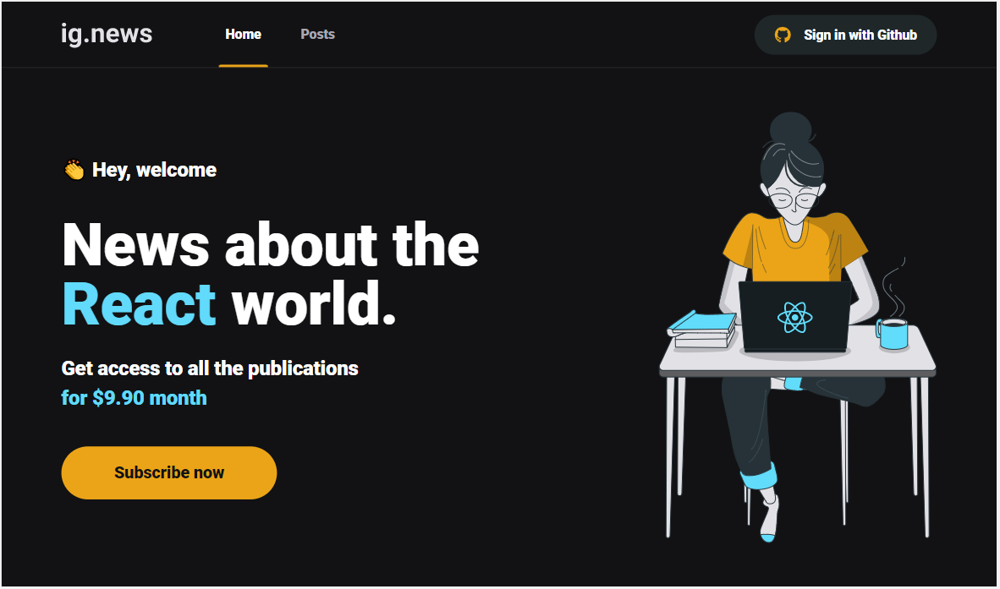

<h1 align="center">Ignews</h1>

<p align="center">
   <a href="#computer-projeto"> Projeto</a>
   &nbsp;&nbsp;&nbsp;|&nbsp;&nbsp;&nbsp;
   <a href="#test_tube-tecnologias">Tecnologias</a>
   &nbsp;&nbsp;&nbsp;|&nbsp;&nbsp;&nbsp;
  <a href="#rocket-executando">Como executar</a>
  &nbsp;&nbsp;&nbsp;|&nbsp;&nbsp;&nbsp;
  <a href="#memo-licença">Licença</a>
</p>

<p align="center">
    
</p>

## :computer: Projeto

<p>
Projeto desenvolvido na trilha ReactJs do Ignite.
</p>

## :test_tube: Tecnologias

Esse projeto foi desenvolvido com as seguintes tecnologias:

#### Site WEB

- [Next.js](https://nextjs.org/)
- [React](https://reactjs.org/)
- [Typescript](https://www.typescriptlang.org/)
- [Prismic CMS](https://prismic.io/lp/headless-content-management-system-brand)
- [Stripe](https://stripe.com/br)
- [Faunadb](https://fauna.com/)
- [NextAuth.js](https://next-auth.js.org/)
- [Sass](https://sass-lang.com/)

## :rocket: Como executar

```bash
# Clone o Repositório
$ git clone https://github.com/adelires/ignews.git

# Acesse a pasta do projeto
$ cd ignews

# Baixe as dependendências
$ yarn install

# Execute
yarn dev

```

### Configuração local

Crie o arquivo .env.local e preencha os campos abaixo

```bash
#Stripe
STRIPE_API_KEY=
NEXT_PUBLIC_STRIPE_PUBLIC_KEY=
STRIPE_SUCCESS_URL=
STRIPE_CANCEL_URL=
STRIPE_WEBHOOK_SECRET=

#Github
GITHUB_ID=
GITHUB_SECRET=

#FaunaDB
FAUNADB_KEY=

#Prismic
PRISMIC_ACCESS_TOKEN=
PRISMIC_ENDPOINT=

```

Acesse <http://localhost:3000> para ver a aplicação.

## :memo: Licença

Este projeto está sob a licença [MIT](./LICENSE).

---
